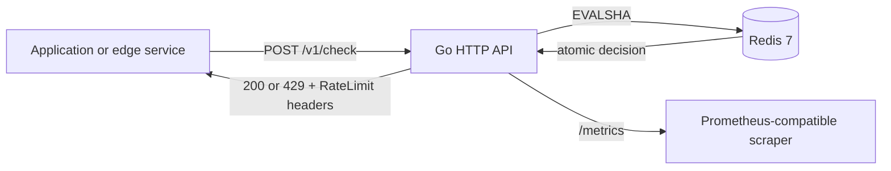

# Architecture

`redis-token-gate` is a small decision service: callers ask whether an identity
may spend a number of tokens. It does not proxy application traffic, so it can
be deployed independently and used by several services.

## Atomic decision path

Each identity is hashed with SHA-256 before it becomes a Redis key. The Go
service supplies the configured capacity, refill rate, cost, current time, and
TTL to a Lua script. Redis executes the script as a single operation:

1. Read the current token count and timestamp.
2. Refill tokens based on elapsed time, capped at capacity.
3. Allow or deny the requested cost.
4. Persist the new state and an expiry that removes inactive buckets.
5. Return remaining tokens and retry/reset delays.

This prevents the read-modify-write race that would otherwise permit requests
past the configured limit when several API instances handle the same identity.

## Failure and operational behavior

- The process checks Redis during startup and readiness checks; `/healthz` only
  confirms the process is alive, while `/readyz` returns `503` if Redis cannot
  be reached.
- A failed Redis decision returns `503` rather than accidentally allowing
  traffic. Callers can choose a different policy at their own integration edge
  if they require fail-open behavior.
- `API_TOKEN`, when set, protects `POST /v1/check` using a constant-time Bearer
  token comparison. Health, readiness, and metrics remain suitable for platform
  probes; restrict their network access at the deployment boundary if needed.
- The container runs as a non-root user and Compose applies a read-only
  filesystem, drops Linux capabilities, and disables privilege escalation.
